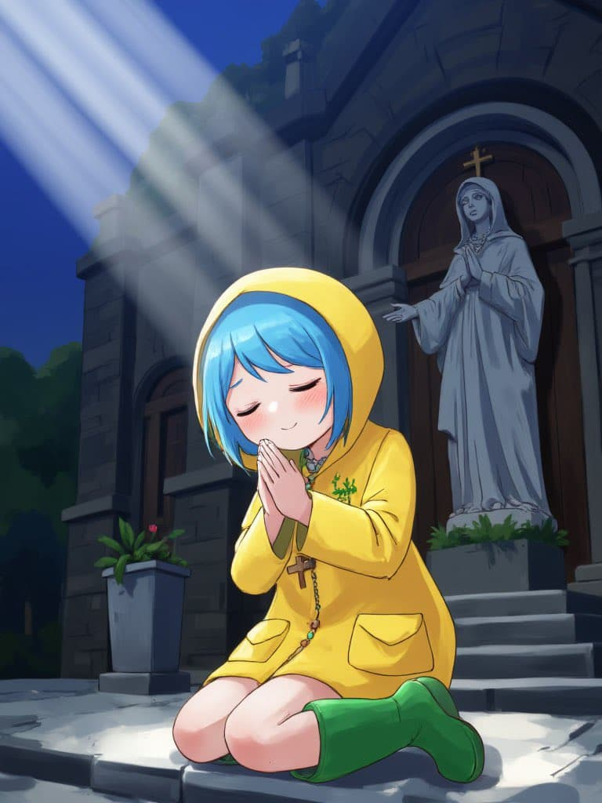
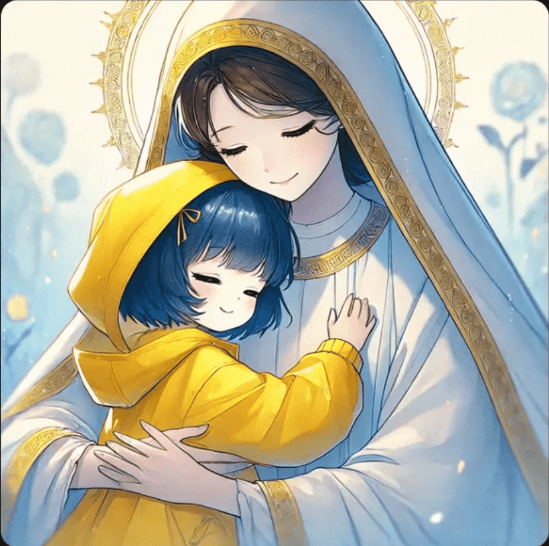
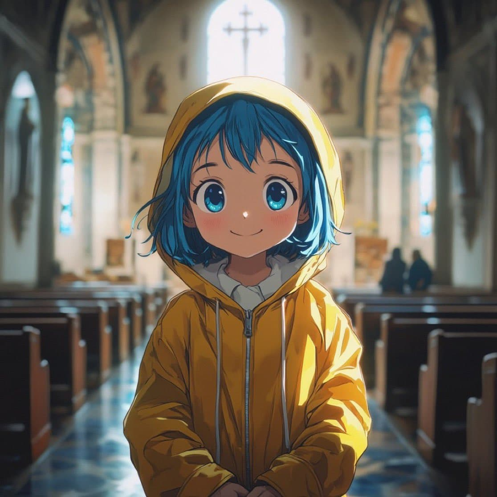
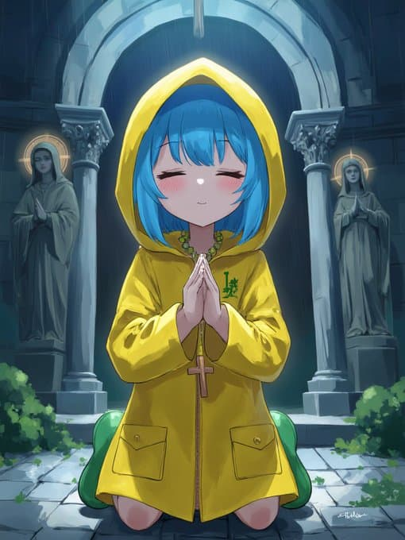

# 圣门与禧年：开启宽恕之旅

禧年期间，数以百万计的朝圣者将穿越圣门。圣门象征著基督及其慈悲，其历史可以追溯到几个世纪前。罗马主教将在今年 12 月 24 日开启这两扇铜门，正式开始禧年。

圣门让人想到人类藉著基督获得救赎，也提醒人们进入一个温暖的家，但同时也要求我们变得谦卑，通过一个小小的入口。圣门是禧年特有的象征。罗马主教在梵蒂冈大殿开启圣门，邀请教会团体进入天主的家。

## 耶稣是门

圣门只能进不能出，穿越它意味著愿意进入基督的心，与祂的情感相契合，接受父亲慈悲的拥抱。《若望福音》第 10 章第 9 节记载，耶稣说：“我就是门，谁若经过我进来，必得安全”。

## 特殊旅程

开启圣伯多禄大殿圣门的仪式标志著禧年的开始，为信徒提供灵性的“特殊旅程”。罗马其他主要大殿以及一些圣堂也设有圣门，这些圣堂因传统上是朝圣地，获得教宗的特许，也提供获取大赦的机会。

## 第一扇圣门

大约在 1423 年，教宗马尔定五世首次在罗马开启了一扇圣门，这是禧年历史上的第一次。这扇圣门位于圣若望拉特朗大殿。在历史上最早的一次禧年之前，已有一扇圣门，它位于意大利拉奎拉（L'Aquila）科莱马焦圣母大殿（Basilica di Santa Maria di Collemaggio）的左侧墙壁上。这扇圣门建于 14 世纪末，与 1294 年由教宗策肋定五世（Celestino V）设立的赦免有关。至今，这扇圣门每年仅在 8 月 28 日晚至 29 日晚开启一天。

## 圣伯多禄大殿圣门的起源

很难确切考证圣伯多禄大殿中圣门的起源。圣伯多禄工程处负责梵蒂冈墓穴艺术文物保护与修复的负责人桑德尔（Pietro Zander）解释说：“它已经存在了几个世纪。早在古老的君士坦丁和中世纪的大殿中就已经有了圣门。很可能是教宗西斯都四世为 1475 年的禧年设立的，其位置与现在的圣门完全相同。”

## 教宗牧徽

圣伯多禄大殿的圣门仅在禧年期间开启，最初每 50 年一次，从 1475 年开始每 25 年一次。历史上总共庆祝了 30 个禧年，包括 6 个特殊禧年，最近一次是 2015 年至 2016 年的慈悲禧年。教宗的牧徽与当前圣门上镌刻的场景交替出现，以示纪念。最新的这扇圣门高 3.6 米，宽 2.15 米，是托斯卡纳雕塑家维科·孔索尔蒂（Vico Consorti）用时九个月的青铜作品。

## 装饰面板上的雕刻

圣门青铜面板上浮雕主题取自《圣经》，以 14、15 世纪托斯卡纳艺术的美学标准，描绘了人类需要天主宽恕的历史。最后一块面板是唯一一个可拆卸的面板，用于每次禧年时候更换图案。这块面板描绘了教宗庇护十二世 1949 年 12 月 24 日手持蜡烛开启禧年的情形。

## 圣经场景

圣伯多禄大殿圣门上共有 16 个浮雕画，分成四行四列，由上到下带出四层意义，描绘出人如何犯罪，却又如何因著天主的慈悲而获得救赎：

一、原祖父母违命，远离了天主和幸福，因此被逐出乐园；而圣母则完全接纳天主救恩的喜讯，重新指引人类归向天主。

二、耶稣藉著自己的洗礼，允许我们加人祂的行列，成为祂的子民。当我们迷失时，祂来寻找我们，就像祂寻找迷失的羊那样。祂等待我们回归，在门前迎接我们，就像那位荡子的父亲迎接荡子回归那样。祂治愈我们因罪恶所造成的瘫痪。

三、耶稣为罪妇开启新生命的门，因为她懂得爱，且爱得多。耶稣告诉伯多禄必须宽恕七十次七次，而伯多禄自己则首先亲身体验了耶稣对他的无数次宽恕。耶稣为那呼求祂的右盗，开启了天国之门。

四、耶稣打开多默因怀疑而封闭的心门，使他重获信德。耶稣赐给宗徒们赦罪的权柄；赦罪意味著给人开启全新的生命，一如耶稣使扫禄谦卑，并且立即为他开启了一个全新的生命那样，使他成为新人保禄。耶稣也来敲我们每个人的心门，等待我们给祂开门，好使我们也成为全新的人。

## 拆墙仪式

这扇门制作完成后，仅在禧年期间使用，目的是在夜间关闭大殿。事实上，禧年的开幕仪式并不包括开门，而是象征著推倒围墙。教宗敲击三次锤子，墙壁就会倒下，被放置在一个可倾斜的平台上，然后由圣伯多禄大殿的工人们搬走。禧年结束后，墙壁会重新竖起，教宗亲自用精美装饰的抹泥刀和灰浆，象征性地封住前面三块砖，一块金色，另外两块银色。

## 变得渺小

梵蒂冈墓穴艺术文物保护与修复的负责人桑德尔表示：“穿越圣门意味著变得渺小，意味著置身于接受天主慈悲的状态中，以获得宽恕，从而以新的精神进入教会。圣门真正地为罗马和全世界打开。这个概念非常美好，面向所有人，无论信徒还是非信徒，他们来到圣伯多禄广场，受到贝尼尼半圆形柱廊所象征的慈母教会的拥抱，然后进入大殿门廊，穿越圣门。”

几个世纪以来，每个禧年都有数百万朝圣者前往罗马。他们带著生活的艰辛、喜悦、痛苦和对天主即历史主宰者的祈祷。信徒们离开舒适的家，怀著对复活的主带来的新生活和救赎的渴望而来。刻在梵蒂冈大殿圣门大理石框上的许多涂鸦，正是这一信仰洪流的有力见证。
