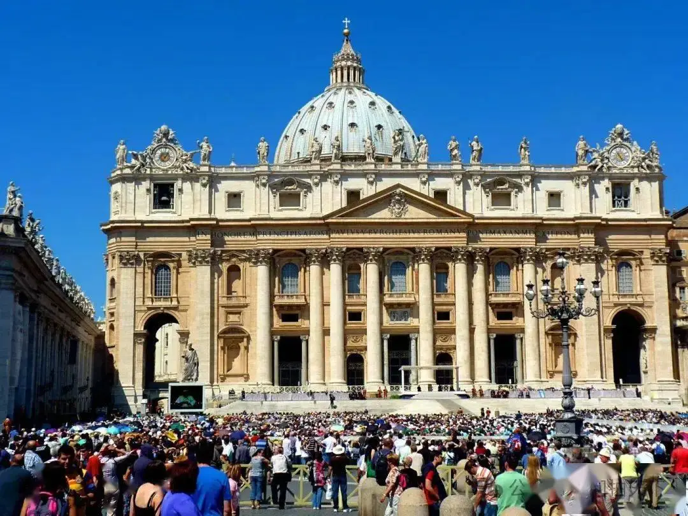
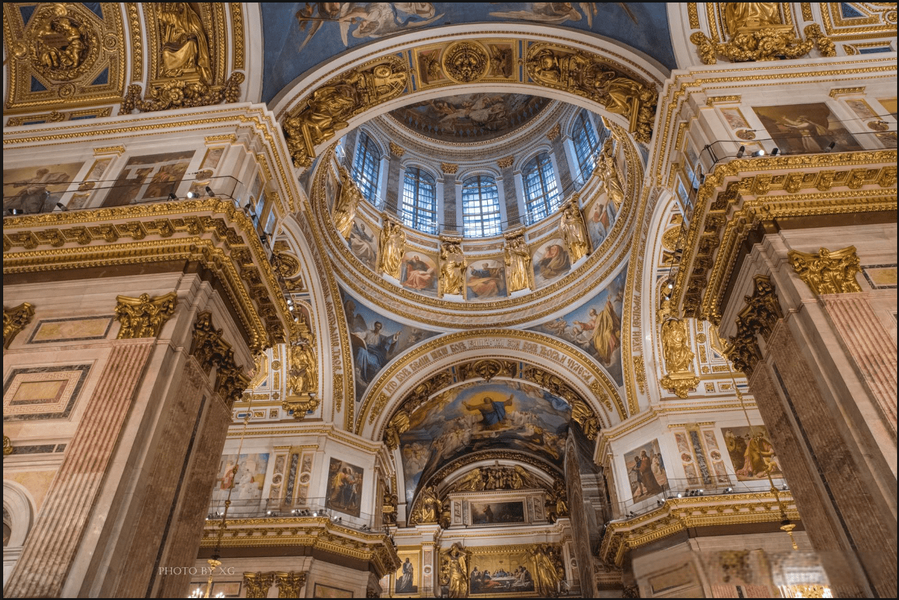
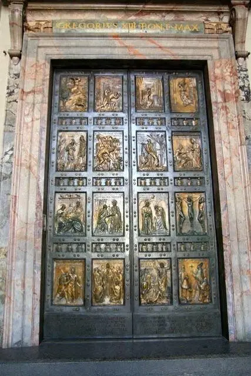

# 2025 罗马禧年

梵蒂冈是世界天主教的心脏，禧年是天主教最大的一项活动之一。根据教皇博尼法斯八世的遗嘱，禧年是赦罪之年，是竞争者和解、皈依、圣事忏悔的一年。最初，根据教皇博尼法斯八世的规定，禧年为 100 年举行一次，所有曾经到访过 15 次以上圣彼得大教堂的罗马人都会获得大赦，并在 1300 年首次庆祝。

然而到了 1350 年，教皇克莱门特六世决定将禧年的频率缩短到 50 年，随后教皇乌尔班六世又将禧年频率缩短到 33 年，最后教皇保罗决定将禧年定为 25 年举办一次。2025 年也是现任教皇方济各继保罗二世在 2000 年举办的禧年之后庆祝的第一个禧年。

禧年最受期待的活动就是圣门的开启，在 2024 年 12 月 24 日，圣彼得大教堂圣门将开启，这对于所有朝圣者都是神圣且隆重的仪式。随后圣保罗大教堂、圣乔瓦尼大教堂和圣母玛利亚大教堂这三大教堂的圣门也将打开供朝圣者进出膜拜，为所有朝圣者提供了一条“非凡之路”。

## 时间线

- 12 月 24 日 圣彼得大教堂圣门开启
- 1 月 24-26 日 通信世界禧年

- 2 月 8 日至 9 日 武装部队、警察和安全部门周年庆典

- 2 月 16 日至 18 日 艺术家禧年

- 2 月 21-23 日 执事禧年

- 3 月 8 日至 9 日 志愿服务世界禧年

- 3 月 28 日 为领主的 24 小时

- 3 月 28 日至 30 日 仁慈传教士禧年

- 4 月 5 日至 6 日 病人和医疗保健禧年

- 4 月 25 日至 27 日 青少年禧年

- 4 月 28 日至 30 日 残疾人禧年

- 5 月 1 日至 4 日 工人禧年

- 5 月 4 日至 5 日 企业家禧年

- 5 月 10 日至 11 日 乐队禧年

- 5 月 16 日至 18 日 兄弟会禧年

- 5 月 24 日至 25 日 儿童禧年

- 5 月 30 日 – 6 月 1 日 家庭、祖父母和老人的禧年

- 6 月 7 日至 8 日 运动、协会和新社区的禧年

- 6 月 9 日 罗马教廷禧年

- 6 月 14 日至 15 日 体育庆典

- 6 月 20-22 日 统治者的禧年

- 6 月 23-24 日 神学院学生禧年

- 6 月 25 日 主教禧年

- 6 月 26 日至 27 日 祭司禧年

- 6 月 28 日 东方教会禧年

- 7 月 28 日 – 8 月 3 日 青年禧年

- 9 月 15 日 安慰禧年

- 9 月 20 日 司法工作者禧年

- 9 月 26 日至 28 日 传教员禧年

- 10 月 5 日 移民禧年

- 10 月 8 日至 9 日 献身生活禧年

- 10 月 11 日至 12 日 圣母灵性禧年

- 10 月 18 日至 19 日 传教士世界禧年

- 10 月 30 日 – 11 月 2 日 教育界的禧年

- 11 月 16 日 穷人的禧年

- 11 月 22-23 日 合唱团和合唱团禧年

- 12 月 14 日 囚犯禧年

- 2025 年 12 月 24 日 圣彼得大教堂圣门关闭
